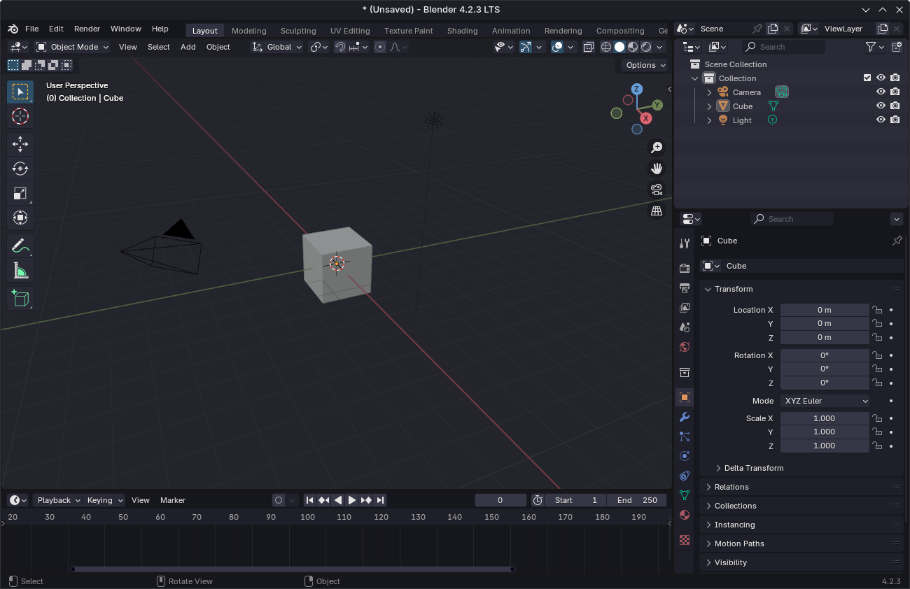

  <h2 align="center">🌊 KANAGAWA.blender 🌊</h2>

  

Blender dark colorscheme inspired by inspired by [kanagawa.nvim](https://github.com/rebelot/kanagawa.nvim) by rebelot. 

  

## Installation
- Download or clone repo
- Open Blender Preferences (Edit > Preferences)
- Switch to Themes section
- Press Install button and select XML file
